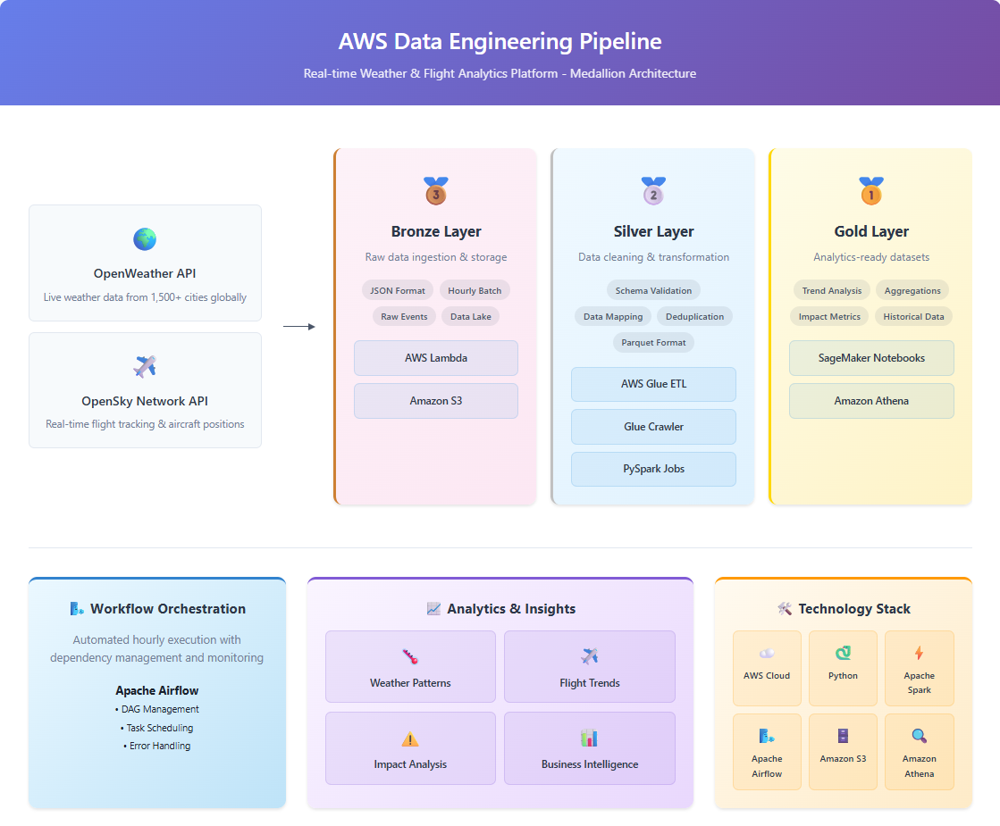
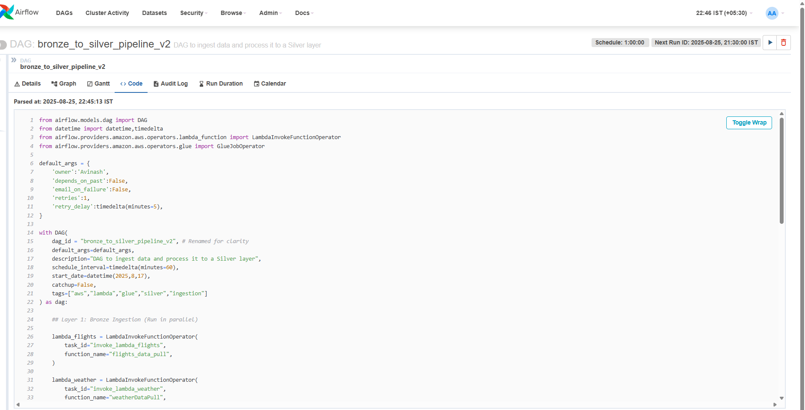
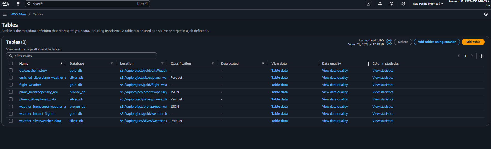
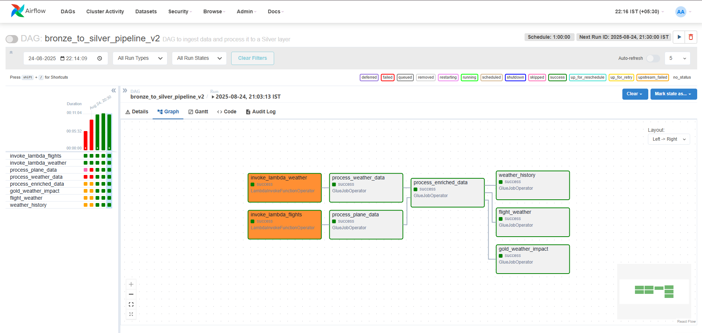
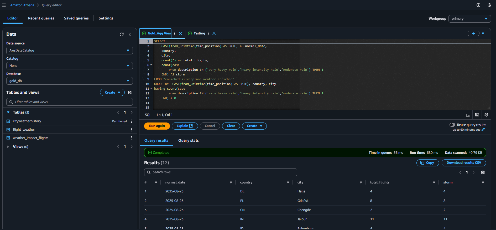
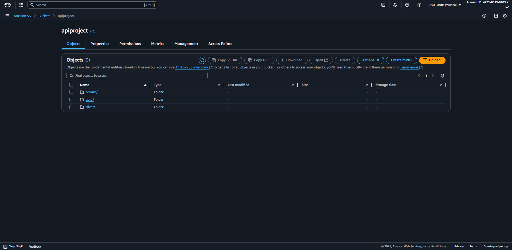
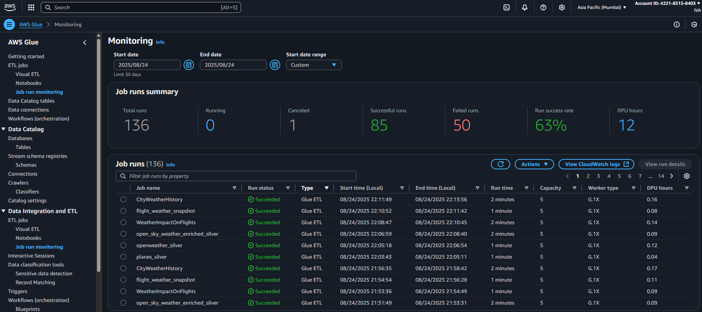

# 🌤️ ✈️ AWS Data Engineering Project: Weather & Flight Analytics Pipeline

[](https://aws.amazon.com/)
[](https://spark.apache.org/)
[](https://airflow.apache.org/)
[](https://python.org/)

> 🚀 A comprehensive real-time data engineering solution that combines live weather and flight data to provide powerful analytics insights using modern AWS services and big data technologies.

## 📋 Table of Contents

- [🌟 Project Overview](#-project-overview)
- [⚡ Tech Stack](#-tech-stack)
- [📊 Data Pipeline Layers](#-data-pipeline-layers)
  - [🥉 Bronze Layer (Data Ingestion)](#-bronze-layer-data-ingestion)
  - [🥈 Silver Layer (Data Processing)](#-silver-layer-data-processing)
  - [🥇 Gold Layer (Analytics Ready)](#-gold-layer-analytics-ready)
- [🔧 Infrastructure & Orchestration](#-infrastructure--orchestration)
- [📁 Project Structure](#-project-structure)
- [🧪 Testing Strategy](#-testing-strategy)
- [📈 Analytics & Insights](#-analytics--insights)
- [🚀 Getting Started](#-getting-started)
- [📸 Project Screenshots](#-project-screenshots)
- [🤝 Contributing](#-contributing)
- [📄 License](#-license)

## 🌟 Project Overview

This project implements a **scalable, real-time data engineering pipeline** that processes live weather and flight data to generate actionable insights. The solution follows the **medallion architecture** (Bronze-Silver-Gold) pattern and leverages cutting-edge AWS services for optimal performance and cost efficiency.

### 🎯 Key Features

- 🌍 **Global Coverage**: Processes weather data from 1,500+ cities worldwide
- ✈️ **Real-time Flight Tracking**: Live aircraft position and status monitoring
- 🎯 **Intelligent Mapping**: Uses Haversine distance algorithm for weather-flight correlation
- 📊 **Advanced Analytics**: Historical trends, weather impact analysis, and flight patterns
- ⚡ **Automated Processing**: Hourly data refresh with Airflow orchestration
- 🔄 **Efficient Processing**: Implements job bookmarking and deduplication


*Architecture Overview - Real-time Weather & Flight Data Pipeline*

## ⚡ Tech Stack

| Category | Technologies |
|----------|-------------|
| **☁️ Cloud Platform** | Amazon Web Services (AWS) |
| **🔄 Orchestration** | Apache Airflow (EC2 + Local) |
| **⚙️ Compute** | AWS Lambda, AWS Glue |
| **💾 Storage** | Amazon S3 (Bronze/Silver/Gold layers) |
| **🔍 Analytics** | Amazon Athena |
| **🚀 Processing** | PySpark, Glue Scripts, Glue Notebooks |
| **📊 Data Sources** | OpenWeather API, OpenSky API |
| **🗃️ Formats** | JSON (Bronze), Parquet (Silver/Gold) |

## 📊 Data Pipeline Layers

### 🥉 Bronze Layer (Data Ingestion)


**Purpose**: Raw data ingestion and storage

#### 🌤️ Weather Data Ingestion
- **Source**: OpenWeather API
- **Coverage**: 1,500+ predefined cities globally
- **Format**: JSON files stored in S3
- **Trigger**: AWS Lambda functions
- **Frequency**: Hourly updates

```python
# Sample Bronze Weather Data Structure
{
  "time": 1756053193,
  "states": [
    [
      "39de4f",
      "TVF14AD ",
      "France",
      1756053192,
      1756053192,
      7.7404,
      50.1109,
      11887.2,
      false,
      233.83,
      61.91,
      0,
      null,
      12237.72,
      "1000",
      false,
      0
    ]
  ]
}
```

#### ✈️ Flight Data Ingestion
- **Source**: OpenSky Network API
- **Data**: Live aircraft positions, altitude, velocity
- **Format**: JSON files stored in S3
- **Processing**: Lambda-based ingestion
- **Updates**: Real-time streaming

```python
# Sample Bronze Flight Data Structure
{
        "coord": {
            "lon": -74.006,
            "lat": 40.7143
        },
        "weather": [
            {
                "id": 803,
                "main": "Clouds",
                "description": "broken clouds",
                "icon": "04d"
            }
        ],
        "base": "stations",
        "main": {
            "temp": 294.31,
            "feels_like": 294.62,
            "temp_min": 294.31,
            "temp_max": 294.31,
            "pressure": 1015,
            "humidity": 82,
            "sea_level": 1015,
            "grnd_level": 1014
        },
        "visibility": 10000,
        "wind": {
            "speed": 3.38,
            "deg": 197,
            "gust": 5.29
        },
        "clouds": {
            "all": 71
        },
        "dt": 1756039504,
        "sys": {
            "country": "US",
            "sunrise": 1756030535,
            "sunset": 1756078889
        },
        "timezone": -14400,
        "id": 5128581,
        "name": "New York",
        "cod": 200
    }
```

### 🥈 Silver Layer (Data Processing)


**Purpose**: Data cleaning, transformation, and structuring

#### 🔄 Processing Features
- **Schema Enforcement**: PySpark StructType definitions
- **Data Partitioning**: 
  - Weather data: By country
  - Flight data: By year and month
- **Quality Assurance**: Duplicate detection and removal
- **Incremental Processing**: Glue job bookmarking
- **Format Conversion**: JSON → Parquet

#### 🧠 Smart Data Enrichment
The **star feature** of the Silver layer is the intelligent weather-flight mapping:

```python
# Haversine Distance Calculation
def haversine_distance(lat1, lon1, lat2, lon2):
    """
    Calculate the great circle distance between two points 
    on the earth (specified in decimal degrees)
    """
    # Implementation details...
```

**Process Flow**:
1. 🌐 Extract flight coordinates
2. 📍 Calculate distance to all weather stations
3. 🎯 Map flight to nearest weather station
4. 🔗 Enrich flight data with weather context

### 🥇 Gold Layer (Analytics Ready)


**Purpose**: Business-ready analytics tables

#### 📊 Analytics Tables

##### 1. 🌍 **Comprehensive Flight-Weather Dataset**
- **Partitioning**: Year and Month
- **Content**: Combined flight and weather data
- **Use Case**: Detailed analytics and reporting

##### 2. 📈 **Historical Weather Trends**
- **Partitioning**: Country
- **Aggregations**: Average, Min, Max temperatures
- **Metrics**: Humidity trends, weather patterns
- **Use Case**: Long-term climate analysis

##### 3. ⚠️ **Weather Impact on Aviation**
- **Metrics**: Flights affected by storms
- **Aggregations**: Delay statistics, safety metrics
- **Insights**: Weather-related flight disruptions
- **Use Case**: Risk assessment and planning

## 🔧 Infrastructure & Orchestration

### 🌬️ Apache Airflow Pipeline



**DAG Structure**:
```python
# Airflow DAG Dependencies
lambda_flights >> process_plane_data
lambda_weather >> process_weather_data

[process_plane_data, process_weather_data] >> process_enriched_data

process_enriched_data >> [gold_weather_impact, flight_weather, weather_history]
```

**Execution Schedule**: Every hour
**Hosting**: AWS EC2 + Local development environment

### 🔍 Amazon Athena Integration



- **Purpose**: SQL-based analytics across all layers
- **Features**: Partition pruning for optimized queries
- **Access**: Direct querying of Bronze, Silver, and Gold data
- **Cost Optimization**: Pay-per-query model

## 📁 Project Structure

```
├── 🌬️ airflow_dags/                    # Orchestration workflows
│   ├── main_pipeline_dag.py
│   └── config/
├── 🥉 bronze/                          # Raw data ingestion
│   └── lambda_script/
│       ├── weather_ingestion.py
│       └── flight_ingestion.py
├── 🥇 gold/                            # Analytics layer
│   └── glue_notebook/
│       ├── weather_analytics.ipynb
│       ├── flight_analytics.ipynb
│       └── impact_analysis.ipynb
├── 🧪 google_Colab/                    # Development & testing
│   ├── data_exploration.ipynb
│   └── algorithm_testing.ipynb
├── 🖼️ img_Src/                         # Documentation images
│   ├── architecture_diagram.png
│   ├── data_flow_diagram.png
│   └── layer_diagrams/
├── 📊 sample_layer_data/               # Sample outputs
│   ├── bronze/
│   │   ├── opensky_api/
│   │   └── openweather_api/
│   ├── gold/
│   │   ├── CityWeatherHistory/
│   │   │   ├── country=AE/
│   │   │   └── country=AF/
│   │   ├── flight_weather_snapshot/
│   │   └── weather_Impact_flights/
│   └── silver/
│       ├── planes_data/
│       │   └── year=2025/month=08/
│       ├── plane_weather_enriched/
│       └── weather_data/
│           ├── country=AE/
│           └── country=AF/
└── 🥈 silver/                          # Data processing layer
    └── glue_Scripts/
        ├── process_weather.py
        ├── process_flights.py
        └── enrich_data.py
```

## 🧪 Testing Strategy

### 🔬 Development Environment
- **Google Colab**: Algorithm development and data exploration
- **Glue Notebooks**: Interactive development and testing
- **Local Testing**: Airflow DAG validation

### ✅ Testing Phases
1. **Unit Testing**: Individual component validation
2. **Integration Testing**: Cross-service communication
3. **Data Quality Testing**: Schema validation and data integrity
4. **Performance Testing**: Processing time and cost optimization

## 📈 Analytics & Insights

**Available Insights**:
- 🌡️ Global temperature trends and patterns
- ✈️ Flight density correlation with weather
- ⛈️ Storm impact on aviation routes
- 📊 Regional weather variations
- 🚀 Flight efficiency metrics

### 📊 Sample Analytics Queries

```sql
-- Weather Impact on Flights
SELECT
    CAST(from_unixtime(time_position) AS DATE) AS normal_date,
    country,
    city,
    COUNT(*) as total_flights,
    COUNT(CASE
        WHEN description IN ('very heavy rain','heavy intensity rain','moderate rain') THEN 1
    END) AS storm
FROM "enriched_silverplane_weather_enriched" 
GROUP BY  CAST(from_unixtime(time_position) AS DATE), country, city
HAVING COUNT(CASE
        WHEN description IN ('very heavy rain','heavy intensity rain','moderate rain') THEN 1
    END) > 0


```

## 🚀 Getting Started

### 📋 Prerequisites
- AWS Account with appropriate permissions
- Python 3.8+
- Apache Airflow 2.0+
- OpenWeather API key
- OpenSky Network access

### ⚙️ Installation

1. **Clone the Repository**
```bash
git clone https://github.com/your-username/aws-weather-flight-pipeline.git
cd aws-weather-flight-pipeline
```

2. **Set Up AWS Resources**
```bash
# Deploy Lambda functions
aws lambda create-function --function-name weather-ingestion
aws lambda create-function --function-name flight-ingestion

# Create S3 buckets
aws s3 mb s3://your-bronze-layer-bucket
aws s3 mb s3://your-silver-layer-bucket
aws s3 mb s3://your-gold-layer-bucket
```

3. **Configure Airflow**
```bash
# Set environment variables
export AIRFLOW_HOME=~/airflow
export AWS_ACCESS_KEY_ID=your_key
export AWS_SECRET_ACCESS_KEY=your_secret

# Initialize Airflow
airflow db init
airflow users create --username admin --firstname Admin --lastname User --role Admin --email admin@example.com
```

4. **Deploy Glue Jobs**
```bash
# Upload Glue scripts to S3
aws s3 cp silver/glue_Scripts/ s3://your-glue-scripts-bucket/ --recursive
```

### 🏃‍♂️ Running the Pipeline

1. **Start Airflow Scheduler**
```bash
airflow scheduler
```

2. **Start Airflow Webserver**
```bash
airflow webserver --port 8080
```

3. **Trigger the Pipeline**
- Access Airflow UI at `http://localhost:8080`
- Enable the main pipeline DAG
- Monitor execution progress

## 📸 Project Screenshots

### 🎛️ Airflow Dashboard


### 📊 Athena Query Console


### 🗃️ S3 Data Organization


### 📈 Glue Job Monitoring


## 🔄 Pipeline Monitoring & Maintenance

### 📊 Key Performance Indicators
- **Data Freshness**: < 1 hour latency
- **Processing Success Rate**: > 99.5%
- **Cost Efficiency**: Optimized through partitioning and Spot instances
- **Data Quality Score**: Automated validation checks

### 🚨 Alerting & Monitoring
- CloudWatch alarms for pipeline failures
- SNS notifications for data quality issues
- Automated retry mechanisms
- Performance metrics tracking

## 🤝 Contributing

We welcome contributions! Please follow these guidelines:

1. **Fork the Repository**
2. **Create a Feature Branch**
```bash
git checkout -b feature/amazing-feature
```
3. **Commit Your Changes**
```bash
git commit -m 'Add some amazing feature'
```
4. **Push to the Branch**
```bash
git push origin feature/amazing-feature
```
5. **Open a Pull Request**

### 🐛 Reporting Issues
Please use the GitHub issue tracker to report bugs or request features.

## 📄 License

This project is licensed under the MIT License - see the [LICENSE](LICENSE) file for details.

---

## 🌟 Acknowledgments

- **OpenWeather**: For providing comprehensive weather data
- **OpenSky Network**: For real-time flight tracking data
- **AWS**: For the robust cloud infrastructure
- **Apache Foundation**: For Spark and Airflow frameworks

---

<div align="center">

**Built with ❤️ using AWS and modern data engineering practices**

[](https://aws.amazon.com/)
[](https://spark.apache.org/)

[⬆️ Back to Top](#️-aws-data-engineering-project-weather--flight-analytics-pipeline)

</div>